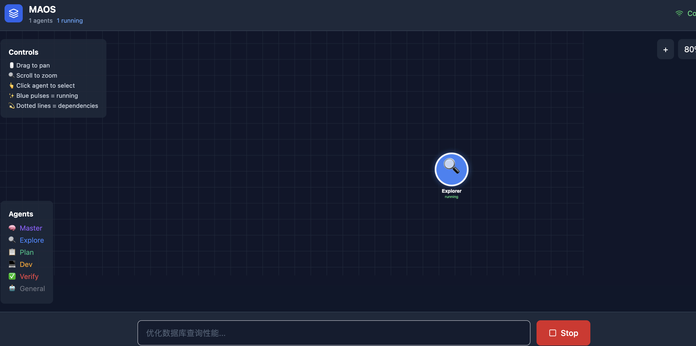

# MAOS - Multi Agent Operating System

🤖 **MAOS** 是一个基于 Claude Code 源码改造的多智能体操作系统，通过 Web 可视化画布展示多 Agent 协作过程。



## ✨ 核心特性

- **🎯 自主任务编排**：主 Agent 自动分析任务并创建合适的 SubAgents
- **👁️ 实时可视化**：Web 画布展示 Agent 状态、消息流、任务依赖图
- **🔄 自适应协作**：SubAgents 之间可以相互通信、动态调整任务分配
- **🔧 复用核心能力**：完全复用 Claude Code 的 Agent 调度、工具执行、权限系统

## 📖 使用场景

```bash
# 启动 MAOS 并自动分析任务
maos run "重构这个代码库的服务层"

# 系统自动：
# 1. 主 Agent 分析任务复杂度
# 2. 创建 Explore Agent 探索代码结构
# 3. 创建 Plan Agent 制定重构计划
# 4. 并行创建多个 Dev Agent 执行重构
# 5. 创建 Verify Agent 验证结果
```

## 🏗️ 系统架构

```
┌─────────────────────────────────────────────────────────────────┐
│                        Web 可视化前端                            │
│  ┌──────────────┐  ┌──────────────┐  ┌──────────────────────┐  │
│  │  Agent 面板   │  │  消息流面板   │  │     任务依赖图        │  │
│  └──────────────┘  └──────────────┘  └──────────────────────┘  │
└──────────────────────────┬──────────────────────────────────────┘
                           │ WebSocket
┌──────────────────────────▼──────────────────────────────────────┐
│                   MAOS Runtime Server                           │
│  ┌─────────────────────────────────────────────────────────┐   │
│  │                    Orchestrator (主 Agent)               │   │
│  │  ┌─────────────┐  ┌─────────────┐  ┌─────────────────┐  │   │
│  │  │ 任务分析器   │  │ Agent 调度器 │  │   状态聚合器     │  │   │
│  │  └─────────────┘  └─────────────┘  └─────────────────┘  │   │
│  └───────────────────────────────┬─────────────────────────┘   │
│                                  │                              │
│       ┌──────────┬──────────┬────┴────┬──────────┐            │
│       ▼          ▼          ▼         ▼          ▼            │
│  ┌────────┐ ┌────────┐ ┌────────┐ ┌────────┐ ┌────────┐      │
│  │Explore │ │  Plan  │ │ Dev-1  │ │ Dev-2  │ │Verify  │      │
│  │ Agent  │ │ Agent  │ │ Agent  │ │ Agent  │ │ Agent  │      │
│  └────────┘ └────────┘ └────────┘ └────────┘ └────────┘      │
└─────────────────────────────────────────────────────────────────┘
                                  │
┌─────────────────────────────────▼─────────────────────────────────┐
│                     Claude Code Core (复用部分)                    │
│  ┌─────────────┐  ┌─────────────┐  ┌─────────────┐              │
│  │  query.ts   │  │ AgentTool   │  │  prompts.ts │              │
│  │  主对话循环  │  │  Agent调度   │  │  系统提示词  │              │
│  └─────────────┘  └─────────────┘  └─────────────┘              │
└────────────────────────────────────────────────────────────────────┘
```

## 🚀 快速开始

### 环境要求

- **Bun** >= 1.3.11
- **Node.js** >= 18 (可选)

### 安装

```bash
# 克隆项目
git clone https://github.com/HeteroCat/MAOS.git
cd MAOS

# 安装所有依赖
bun install:all
```

### 启动

```bash
# 方式1: 一键启动（推荐）
maos run "重构这个代码库"

# 方式2: 开发模式（启动服务器和前端）
bun run dev

# 方式3: 分别启动
bun run server:dev  # 启动 WebSocket 服务器
bun run web:dev     # 启动 Web 前端
```

访问 http://localhost:3000 查看可视化界面

## 📁 项目结构

```
MAOS/
├── maos-server/              # WebSocket 服务器
│   └── src/
│       ├── server.ts         # 服务器入口
│       ├── orchestrator.ts   # 主 Agent 编排器
│       ├── message-bus.ts    # 消息总线
│       └── types.ts          # 类型定义
│
├── maos-web/                 # Web 前端
│   └── src/
│       ├── components/       # React 组件
│       │   ├── AgentCard.tsx
│       │   ├── AgentPanel.tsx
│       │   ├── MessageStream.tsx
│       │   └── TaskInput.tsx
│       ├── hooks/            # 自定义 Hooks
│       │   └── useWebSocket.ts
│       ├── store.ts          # Zustand 状态管理
│       ├── types.ts          # 类型定义
│       ├── App.tsx           # 主应用
│       └── main.tsx          # 入口
│
├── src/                      # Claude Code 源码 (复用)
│   ├── query.ts
│   ├── tools/
│   ├── services/
│   └── ...
│
├── docs/
│   └── design.md            # 详细设计文档
│
├── maos.ts                  # CLI 入口
├── package.json
└── README.md
```

## 🎨 可视化界面

### Agent 面板
- 显示所有运行的 Agent
- 实时更新状态和进度
- 点击查看 Agent 详情

### 消息流
- 展示 Agent 之间的通信
- 支持按 Agent 过滤
- 时间线形式展示

### 任务依赖图 (TODO)
- 可视化任务依赖关系
- 实时展示执行流程
- 支持交互式探索

## 🔌 WebSocket API

### 客户端 → 服务器

```typescript
// 启动任务
{ type: 'start_task', payload: { description: string } }

// 发送消息
{ type: 'send_message', payload: { to: string, content: string } }

// 请求状态
{ type: 'request_status' }

// 停止任务
{ type: 'stop_task', payload: { agentId?: string } }
```

### 服务器 → 客户端

```typescript
// Agent 状态更新
{ type: 'agent_status', payload: AgentState }

// 新消息
{ type: 'new_message', payload: AgentMessage }

// 任务完成
{ type: 'task_completed', payload: { planId, result, agents } }

// 错误通知
{ type: 'error', payload: { code, message, agentId? } }
```

## 🧩 Agent 类型

| Agent 类型 | 职责 | 工具 |
|-----------|------|------|
| **Master** | 任务编排和协调 | Agent, SendMessage, TaskCreate |
| **Explore** | 代码探索和分析 | FileRead, Glob, Grep, Bash |
| **Plan** | 制定实施计划 | FileRead, SendMessage |
| **Dev** | 代码实现 | FileRead, FileEdit, FileWrite, Bash |
| **Verify** | 验证和测试 | FileRead, Bash, SendMessage |

## 🛣️ 路线图

- [x] 基础 WebSocket 通信
- [x] Agent 状态可视化
- [x] 消息流展示
- [ ] 任务依赖图 (React Flow)
- [ ] 集成 Claude Code AgentTool
- [ ] 真实 Agent 执行
- [ ] Replay 模式
- [ ] 性能分析面板
- [ ] 人工干预功能

## 🤝 贡献

欢迎提交 Issue 和 PR！

## 📄 许可证

MIT License

## 🙏 致谢

- [Claude Code](https://docs.anthropic.com/en/docs/claude-code) - Anthropic 官方 CLI 工具
- [claude-code-best](https://github.com/claude-code-best/claude-code) - 源码还原项目
- [React Flow](https://reactflow.dev/) - 节点图可视化库

---

**MAOS** - 让多智能体协作过程一目了然 🤖✨
